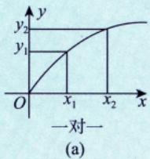
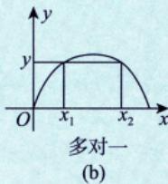
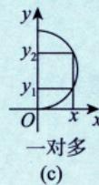
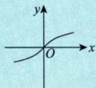
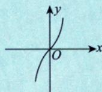
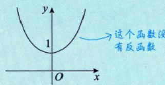

# 函数的概念与特性

## 函数的定义

### 单值函数

> [!def] 函数的定义
> 设 $x$ 与 $y$ 是两个变量，$D$ 是一个给定的数集，若对于每一个 $x \in D$，按照一定的法则 $f$，有一个确定的 $y$ 值与之对应，则称 $y$ 为 $x$ 的函数，记作 $y = f(x)$。
>
> - $x$ 称为**自变量**
> - $y$ 称为**因变量**
> - $D$ 称为**定义域**
> - $\{f(x) | x \in D\}$ 称为**值域**

### 判断方法：铅直画线法

> [!tip] 铅直画线法
> 作铅直线，若任一条铅直线与 $f(x)$ 至多有一个交点，则 $f(x)$ 为**单值函数**。

**单值 vs 多值函数**：

| 类型   | 特征              | 图形表示      |
| ---- | --------------- | --------- |
| 单值函数 | 一个 $x$ 对应一个 $y$ | 一对一 或 多对一 |
| 多值函数 | 一个 $x$ 对应多个 $y$ | 一对多 ❌ 不讨论 |

> [!warning] 考研只研究单值函数！

## 反函数

### 定义

> [!def] 反函数
> 设函数 $y = f(x)$ 的定义域为 $D$，值域为 $R$。如果对于每一个 $y \in R$，必存在唯一的 $x \in D$，使得 $y = f(x)$ 成立，则由此定义的新函数 $x = f^{-1}(y)$ 称为 $y = f(x)$ 的**反函数**。

>[!personal]：设函数 $y = f(x)$ 的定义域为 $D$ ，值域为 $R$ 。如果对于每一个 $y \in R$ ，必存在唯一的 $x \in D$ ，使得 $y = f(x)$ 成立，则由此定义了一个新的函数 $x = \varphi(y)$ ，这个函数称为函数 $y = f(x)$ 的反函数，一般记作 $x = f^{-1}(y)$ ，它的定义域为 $R$ ，值域为 $D$ 。

### 判断方法：水平画线法

> [!tip] 水平画线法
> 在符合铅直画线法的条件下，作水平直线，若任一条水平直线与 $f(x)$ 至多有一个交点，则 $f(x)$ 有反函数。

**口诀**：铅直直线定单、多，水平直线定反、直。

### 重要性质

> [!thm] 反函数重要关系
> $$
> f[f^{-1}(x)] = x, \quad f^{-1}[f(x)] = x
> $$

### 重要结论

1. **严格单调函数必有反函数**
2. **有反函数的函数不一定是单调函数**
3. **互换 $x, y$ 后图像关于 $y = x$ 对称**

> [!example] 反函数求法
> **题目**：求 $y = \ln(x + \sqrt{x^2 + 1})$ 的反函数
>
> **解答**：
> - 由 $y = \ln(x + \sqrt{x^2 + 1})$ 得 $e^y = x + \sqrt{x^2 + 1}$
> - 计算 $e^{-y} = \sqrt{x^2 + 1} - x$
> - 两式相减：$e^y - e^{-y} = 2x$，故 $x = \frac{1}{2}(e^y - e^{-y})$
> - 互换 $x, y$：$y = \frac{1}{2}(e^x - e^{-x})$
>
> **评注**：这是双曲正弦函数 $\text{sh}\,x = \frac{e^x - e^{-x}}{2}$ 的反函数。

>[!personal]：分析 对数函数是一个极为重要的研究对象，三个基本公式要掌握 $(a,b > 0)$ ：
$$
\left\{ \begin{array}{l} {\ln a b = \ln a + \ln b (\text {积 变 和}) ,} \\ {\ln \frac {a}{b} = \ln a - \ln b (\text {商 变 差}) ,} \\ {\ln a ^ {b} = b \ln a (\text {幂 次 变 倍 数}) .} \end{array} \right.
$$

### 三个重要函数（记住！）

| 函数                            | 图像特征     | 重要结论                     |
| ----------------------------- | -------- | ------------------------ |
| $y = \ln(x + \sqrt{x^2 + 1})$ | 奇函数，图(a) | 当 $x \to 0$ 时 $\sim x$   |
| $y = \frac{e^x - e^{-x}}{2}$  | 奇函数，图(b) | 双曲正弦 $\text{sh}\,x$      |
| $y = \frac{e^x + e^{-x}}{2}$  | 偶函数，图(c) | 双曲余弦 $\text{ch}\,x$（悬链线） |
 
图(a)

图(b)

图(c)
## 复合函数

### 定义

> [!def] 复合函数
> 设函数 $y = f(u)$ 的定义域为 $D_1$，函数 $u = g(x)$ 在 $D$ 上有定义，且 $g(D) \subset D_1$，则由
> $$
> y = f[g(x)] \quad (x \in D)
> $$
> 确定的函数称为由 $u = g(x)$ 和 $y = f(u)$ 构成的**复合函数**，$u$ 称为**中间变量**。

### 复合方法

> [!tip] 复合函数的求法
> - **内层先代入**：先把 $g(x)$ 整体代入 $f(u)$
> - **注意定义域**：$g(x)$ 的值域必须在 $f(u)$ 的定义域内

> [!example] 复合函数计算
> **题目**：设 $f(x) = x^2$，$f[\varphi(x)] = -x^2 + 2x + 3$，且 $\varphi(x) \geq 0$，求 $\varphi(x)$
>
> **解答**：
> 由 $f[\varphi(x)] = \varphi^2(x) = -x^2 + 2x + 3$
>
> 故 $\varphi(x) = \sqrt{-x^2 + 2x + 3}$
>
> 由 $-x^2 + 2x + 3 \geq 0$ 得定义域为 $[-1, 3]$
>
> 值域为 $[0, 2]$

>[!personal]：
>  - 方法总结 将 $\varphi (x)$ 视为一个整体口，由 $f[\varphi (x)]$ 已知，可求出 $\varphi (x)$ 。
 > - 公式 若 $\varphi^2 (x) = g(x)$ ，则 $\varphi (x) = \pm \sqrt{g(x)}$

## 隐函数

### 定义

> [!def] 隐函数
> 设方程 $F(x, y) = 0$，若当 $x$ 取某区间内的任一值时，总有满足该方程的唯一的值 $y$ 存在，则称方程 $F(x, y) = 0$ 在上述区间内确定了一个隐函数 $y = y(x)$。

### 隐函数 vs 显函数

> [!tip] 显函数与隐函数
> - **显函数**：$y = f(x)$ 形式，直接表示 $y$ 与 $x$ 的关系
> - **隐函数**：$F(x, y) = 0$ 形式，隐含 $y$ 与 $x$ 的关系

**示例对比**：

| 类型 | 示例 | 说明 |
|------|------|------|
| 可显化的隐函数 | $x + y^3 - 1 = 0 \to y = \sqrt[3]{1-x}$ | 可解出 $y$ |
| 不可显化的隐函数 | $\sin(xy) = \ln\frac{x+e}{y} + 1$ | 无法写成 $y = f(x)$ |

### 存在条件

> [!tip] 隐函数存在条件
> - 能确定隐函数的函数必须是**单值函数**
> - 多值函数不符合铅直画线法，不能确定隐函数

> [!info] 后续预告
> - **隐函数存在定理** → 第三章详细讲解
> - **隐函数求导** → 第四章详细讲解

### 隐函数求值方法

> [!tip] 求隐函数在某点的值
> - **代入法**：直接代入 $x_0$，解方程求 $y(x_0)$
> - **观察法**：不易求出时，通过观察找出显然解

> [!example] 示例1：代入法
> **题目**：设函数 $y = y(x)$ 由方程 $\ln y - \frac{x}{y} + x = 0$ ($x > 0$) 确定，求 $y(2)$
>
> **解答**：
> 代入 $x = 2$：$\ln y - \frac{2}{y} + 2 = 0$
>
> 观察或画图可知：当 $y = 1$ 时，$\ln 1 - 2 + 2 = 0$ 成立
>
> 故 $y(2) = 1$

> [!example] 示例2：观察法
> **题目**：设函数 $y = y(x)$ 由方程 $\ln y + e^{y-1} = \frac{x}{2}$ 确定，求 $y(2)$
>
> **解答**：
> 代入 $x = 2$：$\ln y + e^{y-1} = 1$
>
> 观察可知：当 $y = 1$ 时，$\ln 1 + e^{0} = 0 + 1 = 1$ 成立
>
> 故 $y(2) = 1$

> [!warning] 考研提醒
> 这类隐函数求值问题在考研真题中经常出现，要重视！

## 典型题型

### 题型1：求函数表达式

> [!example] 例1
> **题目**：设 $f(x + \frac{1}{x}) = \frac{x + x^3}{1 + x^4}$，求当 $x \geq 2$ 时的 $f(x)$
>
> **解答**：
> $$
> f\left(x + \frac{1}{x}\right) = \frac{(x + x^3)/x^2}{(1 + x^4)/x^2} = \frac{x + \frac{1}{x}}{x^2 + \frac{1}{x^2}} = \frac{x + \frac{1}{x}}{\left(x + \frac{1}{x}\right)^2 - 2}
> $$
>
> 故当 $x \geq 2$ 时，$f(x) = \frac{x}{x^2 - 2}$

#### 求函数表达式的"整体替换法" ✅

> [!personal] 解题方法总结
> **问题**：做题型1时，想不到将 $x + \frac{1}{x}$ 视为整体
>
> **核心思路：整体替换法**
>
> **步骤1：识别"整体"**
> - 看左边 $f(\square)$ 中的 $\square$ 是什么
> - 例：$f(x + \frac{1}{x})$ 中，整体是 $x + \frac{1}{x}$
>
> **步骤2：配凑右边**
> - 把右边也用这个"整体"表示
> - **技巧**：分子分母同除以 $x^2$（为什么是 $x^2$？因为要凑出 $x + \frac{1}{x}$）
>
> $$
> \frac{x + x^3}{1 + x^4} = \frac{\frac{x + x^3}{x^2}}{\frac{1 + x^4}{x^2}} = \frac{x + \frac{1}{x}}{x^2 + \frac{1}{x^2}}
> $$
>
> **步骤3：利用公式**
> - $(x + \frac{1}{x})^2 = x^2 + 2 + \frac{1}{x^2}$
> - 所以 $x^2 + \frac{1}{x^2} = (x + \frac{1}{x})^2 - 2$
>
> **步骤4：替换**
> - 令 $t = x + \frac{1}{x}$
> - 则 $f(t) = \frac{t}{t^2 - 2}$
>
> **配凑技巧速查表**：
>
> | 右边形式 | 配凑方法 |
> |----------|----------|
> | 含 $x$ 和 $x^3$ | 除以 $x^2$，凑成 $x + \frac{1}{x}$ |
> | 含 $x$ 和常数 | 凑 $(x + a)^2$ 展开 |
> | 分式复杂 | 分子分母同除以最高次幂 |
>
> **关键**：看到 $f(\square)$，就要把右边配凑成 $\square$ 的形式！

#### 求函数表达式的两种方法

> [!tip] 方法选择：配凑法 vs 换元法
>
> | 方法 | 适用场景 | 核心思路 |
> |------|----------|----------|
> | **配凑法** | 右边可以通过代数变形凑成左边"整体"的形式 | 把右边用左边"整体"表示 |
> | **换元法** | 右边复杂，无法直接配凑 | 令 $t = \text{整体}$，反解 $x = f(t)$，代入 |
>
> **配凑法示例**：$f(x + \frac{1}{x}) = \frac{x + x^3}{1 + x^4}$ → 分子分母同除以 $x^2$ 配凑
>
> **换元法示例**：$f(\frac{x}{x+1}) = \frac{x}{1-2x}$ → 令 $t = \frac{x}{x+1}$，反解 $x$

#### 专项练习题

> [!example] 练习1
> **题目**：设 $f(x + 1) = x^2 + 3x + 5$，求 $f(x)$
>
> **解答**：
> 令 $t = x + 1$，则 $x = t - 1$
>
> $f(t) = (t-1)^2 + 3(t-1) + 5 = t^2 - 2t + 1 + 3t - 3 + 5 = t^2 + t + 3$
>
> 故 $f(x) = x^2 + x + 3$

> [!example] 练习2（换元法）
> **题目**：设 $f\left(\frac{x}{x+1}\right) = \frac{x}{1-2x}$，求 $f(x)$
>
> **分析**：右边 $\frac{x}{1-2x}$ 无法直接配凑成 $\frac{x}{x+1}$ 的形式，用**换元法**
>
> **解答**：
> 1. **令换元**：设 $t = \frac{x}{x+1}$
> 2. **反解 $x$**：
>    $$
>    t(x+1) = x \to tx + t = x \to t = x - tx \to t = x(1-t) \to x = \frac{t}{1-t}
>    $$
> 3. **代入原式**：
>    $$
>    f(t) = \frac{\frac{t}{1-t}}{1 - 2 \cdot \frac{t}{1-t}} = \frac{\frac{t}{1-t}}{\frac{1-t-2t}{1-t}} = \frac{\frac{t}{1-t}}{\frac{1-3t}{1-t}} = \frac{t}{1-3t}
>    $$
> 4. **结论**：$f(x) = \frac{x}{1-3x}$

> [!example] 练习3（换元法）
> **题目**：设 $f(\sqrt{x} + 1) = x + 2\sqrt{x}$，求 $f(x)$（$x \geq 1$）
>
> **分析**：右边 $x + 2\sqrt{x}$ 可以写成 $(\sqrt{x})^2 + 2\sqrt{x}$，令 $t = \sqrt{x} + 1$
>
> **解答**：
> 1. **令换元**：设 $t = \sqrt{x} + 1$
> 2. **反解**：
>    $$
>    \sqrt{x} = t - 1 \quad \Rightarrow \quad x = (t-1)^2 = t^2 - 2t + 1
>    $$
> 3. **代入原式**：
>    $$
>    f(t) = (t^2 - 2t + 1) + 2(t-1) = t^2 - 2t + 1 + 2t - 2 = t^2 - 1
>    $$
> 4. **结论**：$f(x) = x^2 - 1$（$x \geq 1$）

### 题型2：方程组法求函数

> [!example] 例2
> **题目**：设 $f(x)$ 满足 $2f(x) + x^2 f(\frac{1}{x}) = \frac{x^2 + 2x}{\sqrt{1 + x^2}}$，求 $f(x)$
>
> **解答**：
> 将 $x$ 换成 $\frac{1}{x}$ 得：
> $$
> 2f\left(\frac{1}{x}\right) + \frac{1}{x^2}f(x) = \frac{1 + 2x}{x\sqrt{1 + x^2}}
> $$
>
> 联立两式，消去 $f(\frac{1}{x})$，得 $f(x) = \frac{x}{\sqrt{1 + x^2}}$

#### 方程组法常见形式

> [!tip] 识别技巧
> 方程组法的特征：**含有 $f(x)$ 和 $f(\frac{1}{x})$（或 $f(-x)$）的关系式**
>
> **方法**：将 $x$ 替换为 $\frac{1}{x}$（或 $-x$），得到第二个方程，联立求解

**常见形式汇总**：

| 形式 | 特征 | 方法 |
|------|------|------|
| $f(x)$ 与 $f(\frac{1}{x})$ | 含倒数关系 | $x \to \frac{1}{x}$ 变换 |
| $f(x)$ 与 $f(-x)$ | 含相反数关系 | $x \to -x$ 变换 |
| $f(x)$ 与 $f(x-a)$ | 平移关系 | $x \to x+a$ 变换 |

#### 专项练习题

> [!example] 练习1
> **题目**：设 $f(x) + 2f\left(\frac{1}{x}\right) = 3x$，求 $f(x)$
>
> **解答**：
> 原式：$f(x) + 2f(\frac{1}{x}) = 3x$ ...①
>
> 令 $x \to \frac{1}{x}$：$f(\frac{1}{x}) + 2f(x) = \frac{3}{x}$ ... ②
>
> 由 ② 得：$f(\frac{1}{x}) = \frac{3}{x} - 2f(x)$
>
> 代入 ①：$f(x) + 2\left(\frac{3}{x} - 2f(x)\right) = 3x$
>
> $f(x) + \frac{6}{x} - 4f(x) = 3x$
>
> $-3f(x) = 3x - \frac{6}{x}$
>
> $f(x) = \frac{2}{x} - x$

> [!example] 练习2
> **题目**：设 $f(x) + f(-x) = e^x$，求 $f(x)$
>
> **提示**：利用奇偶分解：$f(x) = \frac{e^x + e^{-x}}{2}$
>
> **答案**：$f(x) = \text{ch}\,x = \frac{e^x + e^{-x}}{2}$（双曲余弦）

> [!example] 练习3
> **题目**：设 $3f(x) + f\left(\frac{1}{x}\right) = x^2$，求 $f(x)$
>
> **提示**：原式 + 变换后的式子，联立消元
>
> **答案**：$f(x) = \frac{3x^2 - 1}{8x}$

## 易错点 ⚠️

### 易错点1：混淆函数值与极限

- ❌ **错误**：$f(x) \to A$ 就是 $f(x) = A$
- ✅ **正确**：极限是趋近过程，函数值是确定值

### 易错点2：复合函数定义域忽略

- ❌ **错误**：不考虑内层函数值域直接复合
- ✅ **正确**：必须保证 $g(x)$ 的值域在 $f(u)$ 的定义域内

### 易错点3：反函数存在性误判

- ❌ **错误**：单调函数才有反函数
- ✅ **正确**：单调函数必有反函数，但有反函数不一定单调

---

## 我的理解记录 🧠

### 反函数的本质理解 ✅

> [!personal] 学习笔记
> 关于反函数，我理解了以下关键点：
>
> **1. 法则的逆运算**
> - $y = x^2$ 中的"平方"是法则 $f$
> - 反函数$x = y^{\frac{1}{2}}$中的"平方根"是法则 $f^{-1}$
> - $f$ 与 $f^{-1}$ 是互为相反的运算法则
>
> **2. 变量交换是惯例**
> - 原来的反函数形式是 $x = y^{\frac{1}{2}}$
> - 但我们习惯 $y$ 作因变量，$x$ 作自变量
> - 所以交换成 $y = x^{\frac{1}{2}}$（即 $y = \sqrt{x}$）
>
> **3. 互为反函数**
> - $y = x^2$ 与 $y = \sqrt{x}$ 的对应法则互为相反
> - 它们的图像关于 $y = x$ 对称
>
> **⚠️ 重要补充**：
> - $y = x^2$ 在整个定义域 $(-\infty, +\infty)$ 上**没有反函数**（不是一一对应）
> - 必须限制定义域：$y = x^2, x \geq 0$ 的反函数才是 $y = \sqrt{x}$

### 学习心得

- 一开始觉得反函数只是"交换 $x, y$"，现在理解了**法则的逆运算**才是本质
- 变量交换只是数学表达的习惯，不是反函数的核心
- **定义域限制**很重要：只有一一对应的函数才有反函数

---

## 相关知识点 📚

### 前置知识
- 无（函数是高数的起点）

### 后续知识
- [[函数极限]] - 函数极限是函数概念的应用
- [[函数的连续性与间断点]] - 连续性基于函数和极限
- [[导数与微分]]（后续章节）- 复合函数求导

### 跨学科应用 ⚠️
**重要提醒**：
- **复合函数求导**是导数的核心内容
- **反函数求导**是重要求导法则
- **隐函数求导**在考研中经常考查

## 跨学科提醒 ⚠️

> [!info] 电子技术关联
> 函数概念在电路分析中的应用：
> - **输入-输出关系**：电压传递函数
> - **非线性元件**：二极管、晶体管的特性曲线
> - **信号变换**：调制、解调过程中的函数关系

---

*创建日期: 2026-02-28*
