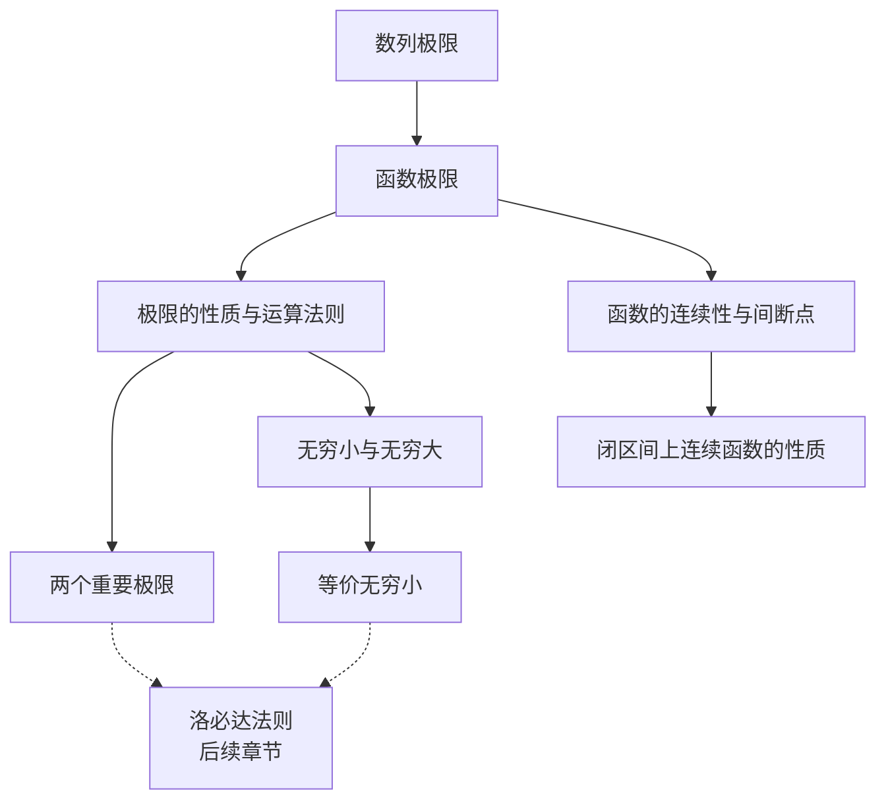

# 函数极限与连续 - 知识图谱

> [!info] 模块信息
> - **模块**: 高等数学 - 极限与连续
> - **考试类型**: 数学二
> - **预计学习时长**: 12-15小时
> - **考试频率**: ⭐⭐⭐⭐⭐ (基础核心，必考)

---

## 📚 知识点导航

### 0. 基础知识 (0-基础知识/)

| 知识点 | 难度 | 重要程度 | 状态 | 笔记链接 |
|--------|------|----------|------|----------|
| 函数的概念与特性 | ⭐⭐ | ⭐⭐⭐⭐ | ✅ 已创建 | [[0-基础知识/函数的概念与特性]] |
| 函数的四种特性 | ⭐⭐ | ⭐⭐⭐⭐ | ✅ 已创建 | [[0-基础知识/函数的四种特性（重要）]] |
| 基本初等函数 | ⭐⭐ | ⭐⭐⭐⭐⭐ | ✅ 已创建 | [[0-基础知识/基本初等函数]] |
| 邻域概念 | ⭐ | ⭐⭐⭐ | ✅ 已创建 | [[0-基础知识/邻域概念]] |

### 1. 极限概念与性质 (1-极限概念与性质/)

| 知识点 | 难度 | 重要程度 | 状态 | 笔记链接 |
|--------|------|----------|------|----------|
| 数列极限 | ⭐⭐ | ⭐⭐⭐⭐ | 🔴 待学 | [[1-极限概念与性质/数列极限]] |
| 函数极限 | ⭐⭐⭐ | ⭐⭐⭐⭐⭐ | 🔴 待学 | [[1-极限概念与性质/函数极限]] |
| 极限的性质与运算法则 | ⭐⭐ | ⭐⭐⭐⭐ | 🔴 待学 | [[1-极限概念与性质/极限的性质与运算法则]] |

### 2. 重要极限与技巧 (2-重要极限与技巧/)

| 知识点 | 难度 | 重要程度 | 状态 | 笔记链接 |
|--------|------|----------|------|----------|
| 两个重要极限 | ⭐⭐⭐ | ⭐⭐⭐⭐⭐ | 🔴 待学 | [[2-重要极限与技巧/两个重要极限]] |
| 无穷小与无穷大 | ⭐⭐⭐ | ⭐⭐⭐⭐ | 🔴 待学 | [[2-重要极限与技巧/无穷小与无穷大]] |
| 等价无穷小 | ⭐⭐⭐⭐ | ⭐⭐⭐⭐⭐ | 🔴 待学 | [[2-重要极限与技巧/等价无穷小]] |

### 3. 连续性理论 (3-连续性理论/)

| 知识点 | 难度 | 重要程度 | 状态 | 笔记链接 |
|--------|------|----------|------|----------|
| 函数的连续性与间断点 | ⭐⭐⭐ | ⭐⭐⭐⭐⭐ | 🔴 待学 | [[3-连续性理论/函数的连续性与间断点]] |
| 闭区间上连续函数的性质 | ⭐⭐⭐⭐ | ⭐⭐⭐⭐ | 🔴 待学 | [[3-连续性理论/闭区间上连续函数的性质]] |

---

## 🎯 学习路线

```
阶段1: 基础概念 (3-4小时)
  数列极限 → 函数极限 → 极限性质
       ↓
阶段2: 计算方法 (4-5小时)
  重要极限 → 无穷小 → 等价无穷小 (重点!)
       ↓
阶段3: 连续理论 (3-4小时)
  连续性 → 间断点 → 闭区间性质
       ↓
阶段4: 综合应用 (2-3小时)
  极限计算综合题 → 证明题
```

---

## 🔗 知识点关联图



---

## ⚠️ 跨章节提醒

> [!warning] 与后续章节的关联
> - **等价无穷小** 是 [[洛必达法则]] 的重要辅助工具
> - **两个重要极限** 是 [[泰勒公式]] 的基础
> - **连续性** 是 [[导数定义]] 的前置知识
> - **闭区间性质** 在 [[定积分]] 中有重要应用

---

## 📊 考情分析

### 数二考点分布
| 考点 | 题型 | 出现频率 |
|------|------|----------|
| 极限计算 | 选择/填空/解答 | 每年必考 |
| 连续性判断 | 选择/填空 | 高频 |
| 间断点分类 | 选择/填空 | 中高频 |
| 闭区间性质证明 | 解答题 | 中频 |

### 重点提醒
1. ⭐⭐⭐⭐⭐ **等价无穷小**：计算利器，必须熟练掌握
2. ⭐⭐⭐⭐⭐ **两个重要极限**：基础中的基础
3. ⭐⭐⭐⭐ **间断点分类**：常考选择题
4. ⭐⭐⭐⭐ **闭区间性质**：证明题常用工具

---

## 📝 学习建议

1. **先理解极限的 $\varepsilon-N$、$\varepsilon-\delta$ 定义**（虽然不常直接考，但有助于理解本质）
2. **重点掌握计算方法**：等价无穷小、重要极限是核心
3. **间断点分类要记牢**：第一类 vs 第二类，可去 vs 跳跃 vs 无穷
4. **闭区间三定理要会用**：最值定理、零点定理、介值定理

---

*最后更新: 2026-02-28*
