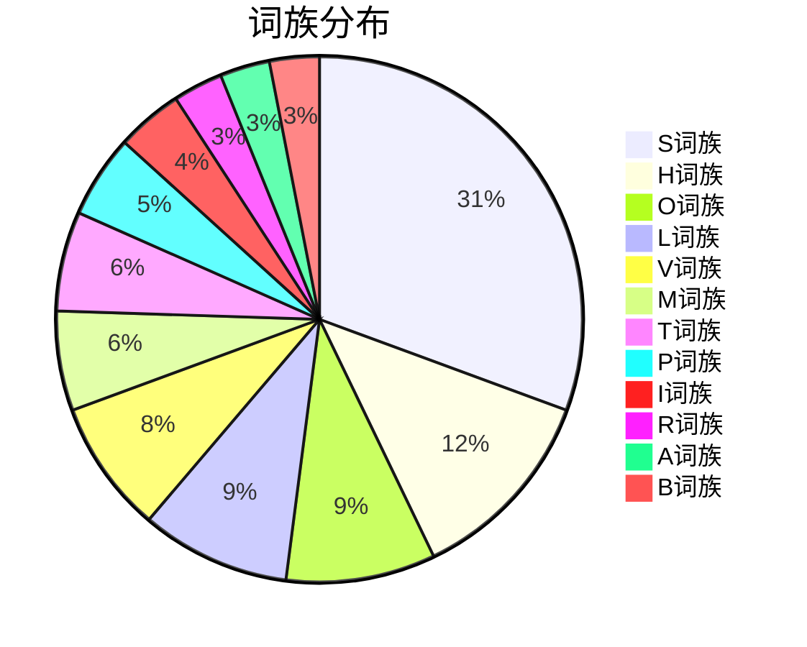

# 📊 词汇统计 Day-2026-3-27

> **统计日期**: 2026-03-27
> **来源文件**: [[考研英语/英语单词/2026-3-27-整理版.md|2026-3-27 整理版]]

---

## 📈 总体统计

| 指标 | 数值 |
|------|------|
| **单词总数** | 75 |
| **词族数量** | 12 |
| **高频词 (⭐⭐⭐)** | 38 (51%) |
| **中频词 (⭐⭐)** | 27 (36%) |
| **低频词 (⭐)** | 10 (13%) |

---

## 📊 词族分布

---

## 🎯 考频分布

| 考频等级 | 数量 | 占比 | 说明 |
|----------|------|------|------|
| ⭐⭐⭐ 高频 | 38 | 51% | 真题反复出现，必须掌握 |
| ⭐⭐ 中频 | 27 | 36% | 偶尔出现，需熟悉 |
| ⭐ 低频 | 10 | 13% | 了解即可 |

---

## ⚠️ 僻义预警 (8词)

> [!danger] 这些单词有考研常考的僻义！

| 单词 | 常见义 | ⚠️ 僻义 | 重要程度 |
|------|--------|---------|----------|
| **screen** | 屏幕 | 审查，筛选 | ⭐⭐⭐ |
| **pedestrian** | 行人 | 乏味的，平庸的 | ⭐⭐⭐ |
| **harbor** | 港口 | 心怀（怨恨等）；窝藏 | ⭐⭐⭐ |
| **odd** | 奇怪的 | 奇数的 | ⭐⭐⭐ |
| **tell** | 告诉 | 分辨，辨别 | ⭐⭐⭐ |
| **scrap** | 碎片 | 废弃，取消 | ⭐⭐ |
| **vein** | 静脉 | 风格，语调 | ⭐⭐ |
| **tear** | 眼泪 | 撕裂 | ⭐⭐ |

---

## 📚 词根词缀统计

| 词根/词缀 | 含义 | 涉及单词数 | 代表词 |
|-----------|------|------------|--------|
| **satis-** | 足够 | 3 | satisfy, satisfaction, satisfactory |
| **sect-/seg-** | 切割 | 3 | section, sector, segment |
| **manu-** | 手 | 3 | manual, manufacture, manuscript |
| **ob-** | 反对，逆向 | 3 | obstacle, obstruct, obstruction |
| **scrip-/script-** | 写 | 2 | script, manuscript |
| **imper-** | 命令 | 1 | imperative |
| **pet-** | 追求 | 1 | impetus |
| **vers-** | 转向 | 3 | versatile, verse, versus |

---

## 🔤 易混淆词组

| 词组 | 含义 | 对比 |
|------|------|------|
| **heroine** vs **heroin** | 女英雄 vs 海洛因 | 注意e的有无 |
| **odor** vs **odour** | 气味(美式) vs 气味(英式) | 拼写差异 |
| **harbor** vs **harbour** | 港口(美式) vs 港口(英式) | 拼写差异 |
| **maneuver** vs **manoeuvre** | 策略(美式) vs 策略(英式) | 拼写差异 |

---

## 📝 高频词组 Top 10

| 排名 | 词组 | 含义 | 出现频率 |
|------|------|------|----------|
| 1 | **from scratch** | 从头开始 | ⭐⭐⭐ |
| 2 | **on the verge of** | 濒临于 | ⭐⭐⭐ |
| 3 | **at odds with** | 与...有分歧 | ⭐⭐⭐ |
| 4 | **satisfy one's needs** | 满足需要 | ⭐⭐⭐ |
| 5 | **be under scrutiny** | 受到审查 | ⭐⭐⭐ |
| 6 | **hardly any** | 几乎没有 | ⭐⭐⭐ |
| 7 | **launch a campaign** | 发起运动 | ⭐⭐⭐ |
| 8 | **imperative to do** | 急需做某事 | ⭐⭐⭐ |
| 9 | **tell A from B** | 分辨A和B | ⭐⭐⭐ |
| 10 | **an obstacle to** | ...的障碍 | ⭐⭐⭐ |

---

## 📅 复习计划

根据 SM-2 间隔重复算法：

| 复习轮次 | 日期 | 重点内容 |
|----------|------|----------|
| 第1次 | 2026-03-28 | 全部75词 |
| 第2次 | 2026-03-30 | 错词+僻义词 |
| 第3次 | 2026-04-03 | 高频词38词 |
| 第4次 | 2026-04-10 | 全部复习 |

---

## 📊 学习建议

> [!tip] 今日重点
> 1. **优先记忆**: 38个高频词 (⭐⭐⭐)
> 2. **僻义必背**: 8个僻义预警词
> 3. **词根记忆**: sect-(切割)、manu-(手)、ob-(反对)
> 4. **易混淆词**: heroine/heroin

> [!warning] 注意事项
> - `hardly` 是否定副词，句首倒装
> - `tear` 作名词和动词发音不同
> - `pedestrian` 作形容词 = 乏味的

---

## 🔗 关联笔记

- [[考研英语/英语单词/2026-3-27-整理版.md|整理版单词表]]
- [[考研英语/📰 真题语境文章/Context-Day-027-2026-03-27.md|真题语境文章]]
- [[考研英语/📝 测试记录/Quiz-Day-027-2026-03-27.md|测试记录]]
- [[考研英语/✍️ 写作输出/Writing-Day-027-2026-03-27.md|写作输出]]

---

*统计时间: 2026-03-27*
